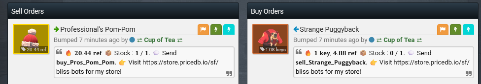

# TF2Autobot (pricedb.io fork)

This is a fork of [TF2Autobot](https://github.com/idinium96/tf2autobot), with changes made to work and use [pricedb.io](https://pricedb.io) as the default pricing source after the shutdown of prices.tf.

It keeps the core behaviour and setup flow of the original project, but:

-   Uses [pricedb.io](https://pricedb.io) as the default pricer.
-   Integrates the [pricedb.io](https://store.pricedb.io) Store API so backpack.tf sell listings can be mirrored to pricedb.io.
-   Key Pricing Configuration to allow the key value context to be set (default same behaviour as autobot)

If you already know how to run TF2Autobot, you can treat this as a drop‑in replacement with the extra pricedb.io integration enabled.

## Getting started

All general installation and configuration steps are the same as TF2Autobot. Follow the original wiki for:

-   [Setup & configuration](https://github.com/idinium96/tf2autobot/wiki)
-   [Environment variables](https://github.com/idinium96/tf2autobot/wiki/Configuring-the-bot)
-   [`options.json` reference](https://github.com/idinium96/tf2autobot/wiki/Configure-your-options.json-file)

When the wiki tells you to clone the TF2Autobot repo, use this fork instead:

```bash
git clone https://github.com/TF2-Price-DB/tf2autobot-pricedb.git
```

Then apply new settings as per below unique to this fork!

### Global Disable for Chat Messages

After Valve started banning bots for sending messages it has been the recommendation that your bot doesnt send chat messages. To solve this a global block has been added which can be seen below. It is suggested to set your values to the below as a minimum however disabling commands is also suggested.

Configure in `options.json`:

```json
"globalDisable": {
    "messages": true,
    "greeting": true,
    "commands": false,
    "adminCommands": false
}
```

Look at the example [options.json](.example/options.json) for where this should go in the options file!

### Easy Copy Paste (ECP)

[Easy Copy Paste](https://github.com/TryHardDo/EasyCopyPaste) by [TryHardDo](https://github.com/TryHardDo/) has been integrated in this project. What this allows you to do is change you buy and sell commands to a much easier and user friendly format.

For example `!buy Burning Team Captain` becomes `buy_burning_team_captain` which is far easier to copy from listings. In order to add this to your listings you would update your buy and sell messages as per the below example.

```json
    "buy": "🔥 %price% 📦 Stock : %current_stock% / %max_stock%. 💬 Send %ecp_item%. 👉 Visit %pricedb_store% for my store!",
    "sell": "🔥 %price% 📦 Stock : %amount_trade% / %max_stock%. 💬 Send %ecp_item%. 👉 Visit %pricedb_store% for my store!",
```

This results in listings like the below



To set your ECP text to bold you would change the below in your `options.json`:

```json
"ecp": {
    "useBoldChars": true,
    "useWordSwap": true
}
```

Look at the example [options.json](.example/options.json) for where this should go in the options file!

### Pure Per Unit (PPU) Logic Updates

PPU has been reworked to handle stock counts of more than 1 item. This has been implemented through saving buys to a new queue working off FIFO (First in First out) logic. When a sale of an item is made the FIRST item in the queue dictates the lowest the sell price can fall before becoming frozen. The item will unfreeze if the sell raises above the first queued buy price again.

This results in items not being sold for a loss but can mean items are held during dips in item prices. This can be resolved by setting a timeout on top of the PPU settings to automatically revoke the PPU boundary in order to take the loss but move the item.

Configure in `options.json`:

```json
"partialPriceUpdate": {
    "enable": true,
    "thresholdInSeconds": 604800,
    "excludeSKU": [],
    "removeMaxRestriction": true,
    "maxProtectedUnits": -1,
    "minProfitScrap": 1,
    "stockGracePeriodSeconds": 3600
},
```

Look at the example [options.json](.example/options.json) for where this should go in the options file!

### Stats Command Improvements

If upgrading, rename your existing `polldata.json` to `polldata.old.json` otherwise historical data will skew !stats (optional)
The new stats system uses new logic to track profit by recording keys and metal separately to prevent point in time issues. These are used to provide estimated profit/loss with the !stats command. This change is backwards compatible with Autobot.

### store.pricedb.io configuration

If you want to use store.pricedb.io follow the below

1. **Environment variable**

    Set your pricedb.io Store API key in your process manager (PM2 ecosystem, Docker env, or system env):

    ```bash
    PRICEDB_STORE_API_KEY=your_pricedb_store_api_key_here
    ```

2. **`options.json` misc settings**

    In your `options.json`, under `miscSettings`, add or update:

    ```json
    "pricedbStore": {
      "enable": true,
      "enableInventoryRefresh": true
    }
    ```

    This enables the pricedb.io Store Manager and allows the bot to periodically refresh your pricedb.io inventory.

3. **Template variable for listings**

    You can include your pricedb.io store URL in your backpack.tf listing notes by using the `%pricedb_store%` template variable. The bot will automatically replace it with your friendly store URL (e.g., `https://store.pricedb.io/sf/your-slug`).

    Example in your listing note:

    ```
    Visit my store: %pricedb_store%
    ```

After these changes, rebuild (if needed) and fully restart the bot so the new environment variable is picked up.

---

## Key Pricing Configuration

The bot supports configurable key pricing behavior when calculating trade values to ensure accurate valuations.

### Configuration Option

In your `options.json`, under `miscSettings.counterOffer`, you can control how key prices are used:

```json
"counterOffer": {
  "enable": true,
  "useSeparateKeyRates": true
}
```

### Behavior

**When `useSeparateKeyRates: true`:**

-   Uses **sell price** when calculating the value of keys the bot is giving
-   Uses **buy price** when calculating the value of keys the bot is receiving
-   This ensures bot-favorable pricing in all trade calculations

**When `useSeparateKeyRates: false` (default):**

-   Uses **sell price** for keys on both sides of the trade
-   Maintains the original bot behavior

### Why This Matters

When processing offers, the bot needs to calculate the total value of items on each side of the trade. Keys are valued differently depending on whether the bot is buying or selling them.

With `useSeparateKeyRates: true`, the bot will:

-   Value keys in "our items" (bot is giving) at the **sell price**
-   Value keys in "their items" (bot is receiving) at the **buy price**

This prevents value calculation errors and ensures the bot maintains proper profit margins when keys are involved in trades. The setting affects both initial offer processing and counter offer generation.

**Example:**
If key buy price is 60 ref and sell price is 61 ref:

-   `useSeparateKeyRates: true`: When bot gives 1 key, it's valued at 61 ref; when bot receives 1 key, it's valued at 60 ref
-   `useSeparateKeyRates: false`: All keys valued at 61 ref (sell price) regardless of direction (default autobot behaviour)

---

## Links

For general documentation, troubleshooting and FAQs, keep using the original TF2Autobot wiki:

-   [Wiki home](https://github.com/idinium96/tf2autobot/wiki)
-   [Common errors](https://github.com/idinium96/tf2autobot/wiki/Common-Errors)
-   [FAQ](https://github.com/idinium96/tf2autobot/wiki/FAQ)

For issues or questions specific to this pricedb.io fork (or to my services), please join our Discord:

-   [Discord](https://discord.com/invite/7H2bceTgQK)

---

## Credits

-   Original project: [TF2Autobot by IdiNium](https://github.com/idinium96/tf2autobot)
-   Based on [tf2-automatic by Nicklason](https://github.com/Nicklason/tf2-automatic)
